# An end to end demo using BNK Forge and roksbnkctl for deployment use cases

This guide walks through installing **BIG-IP Next for Kubernetes (BNK)** onto IBM
Cloud ROKS clusters using **BNK Forge** and **roksbnkctl**, covering four
deployment situations you are likely to meet in the field.

You will add one Git repository to BNK Forge, and everything else — the modules,
the blueprints, the forms — arrives with it.

**Before you start you need**

| | |
|---|---|
| BNK Forge | **3.1.6** or later, reachable over HTTPS |
| An IBM Cloud credential template | configured on BNK Forge, with an API key that can create VPCs, clusters and Transit Gateways |
| IBM Cloud Object Storage | holding your F5 FAR auth key and subscription JWT |
| A Transit Gateway | existing, for the disconnected use cases |

Everything else is created for you.

---

## The four use cases

| # | Use case | What it creates | Where images come from |
|---|---|---|---|
| **1** | **New cluster, connected** | VPC, ROKS cluster, Transit Gateway | F5's registry, direct |
| **2** | **New cluster, disconnected** | VPC, ROKS cluster | your private mirror |
| **3** | **Existing cluster, connected** | nothing — adopts your cluster | F5's registry, direct |
| **4** | **Existing cluster, disconnected** | nothing — adopts your cluster | your private mirror |

"Connected" means the cluster's worker nodes can reach the Internet, so BNK
pulls straight from F5 and licenses directly. "Disconnected" means they cannot:
images come from a private registry you have mirrored, and licensing goes
through an F5 License Proxy running inside your network.

Use cases 2 and 4 need two supporting pieces built first — a private registry
and a License Proxy. Blueprints are provided for both, and **Step 4** walks
through them. Build them once and several disconnected clusters can share them.

---

## Step 1 — Sign in

Open BNK Forge in a browser and sign in.

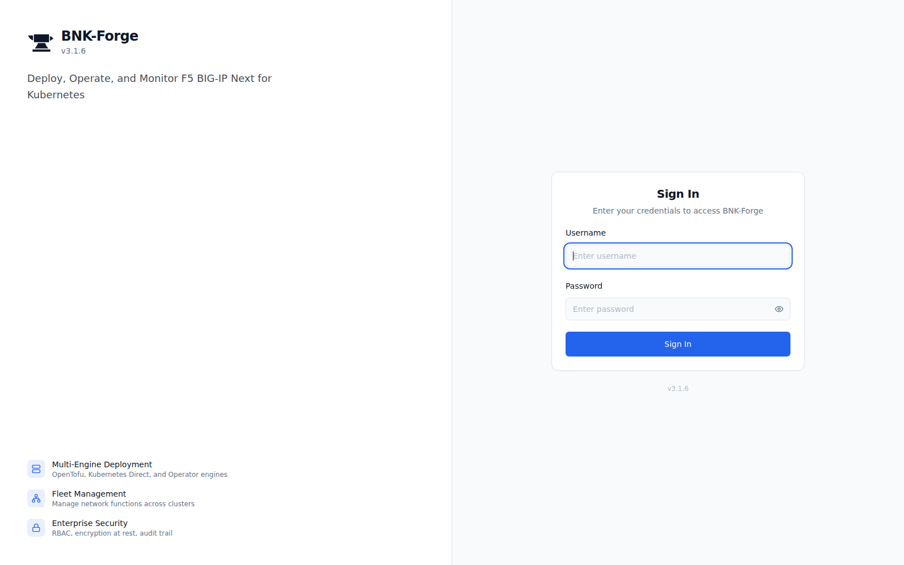

You land on the Command Center. A fresh install shows no projects and no
clusters.

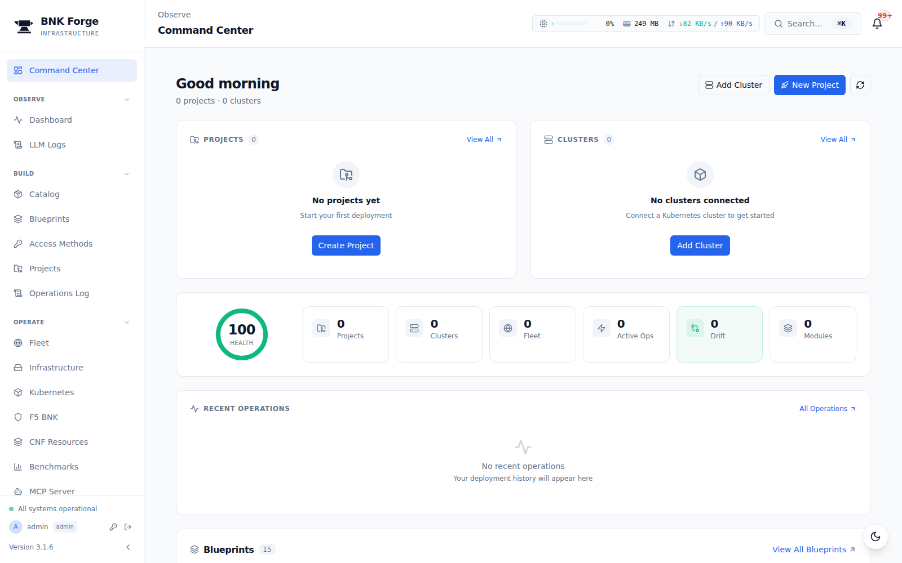

---

## Step 2 — Add the blueprint repository

Everything in this demo comes from one Git repository. Go to **Catalog** in the
left-hand menu.

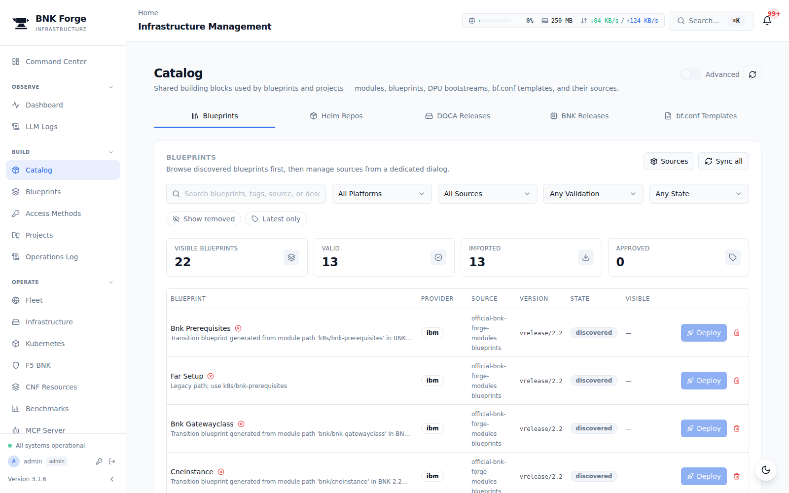

Click **Sources** on the right of the Blueprints panel. This lists the Git
repositories that feed the catalog.

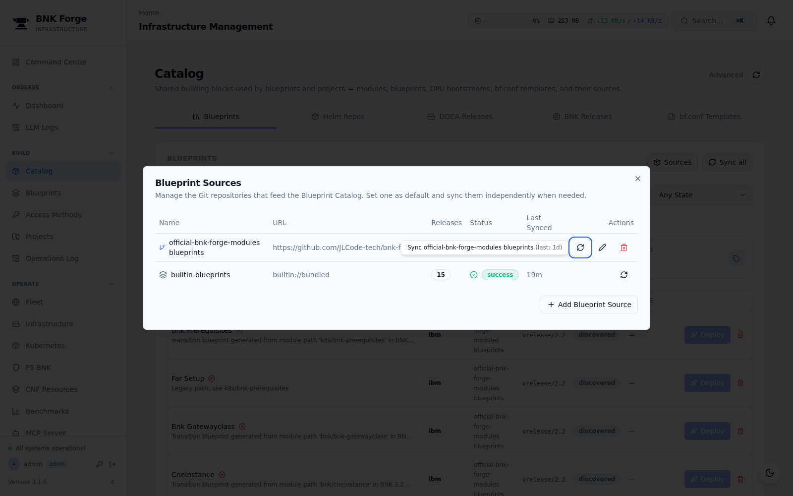

Click **+ Add Blueprint Source**.

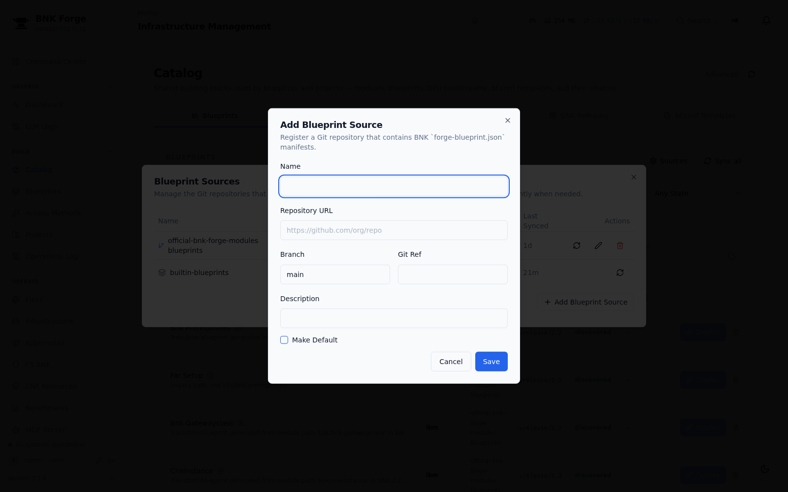

Fill in these four fields — leave **Git Ref** empty and leave **Make Default**
unchecked:

| Field | Value |
|---|---|
| **Name** | `roksbnkctl-bnk-forge` |
| **Repository URL** | `https://github.com/jgruberf5/roksbnkctl-bnk-forge` |
| **Branch** | `main` |
| **Description** | `ROKS deployment blueprints driven by roksbnkctl` |

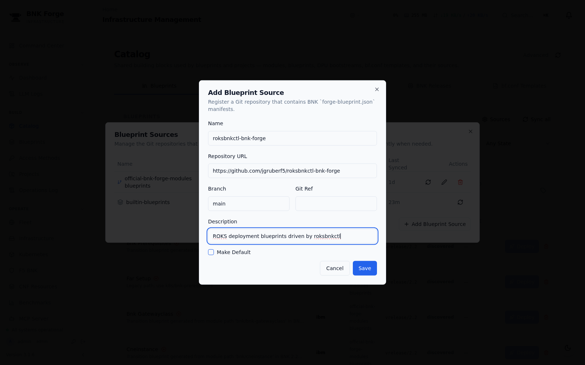

Click **Save**. BNK Forge clones the repository and reads its manifests. When
the sync finishes you have **7 modules** and **7 blueprints**, all at version
**5.0.0**.

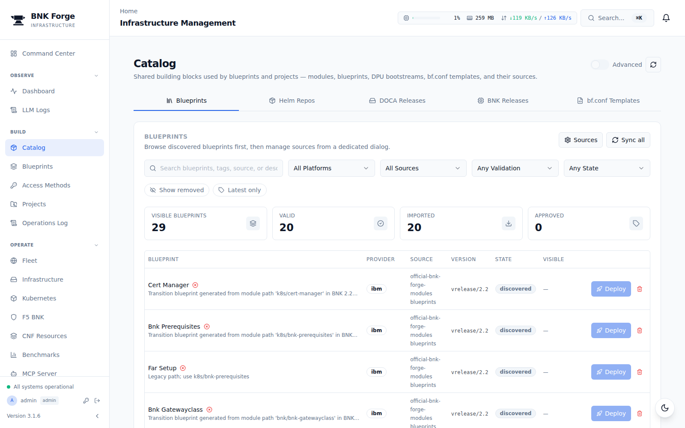

---

## Step 3 — Find the blueprints

Go to **Blueprints** in the left-hand menu and type `ROKS` in the search box.

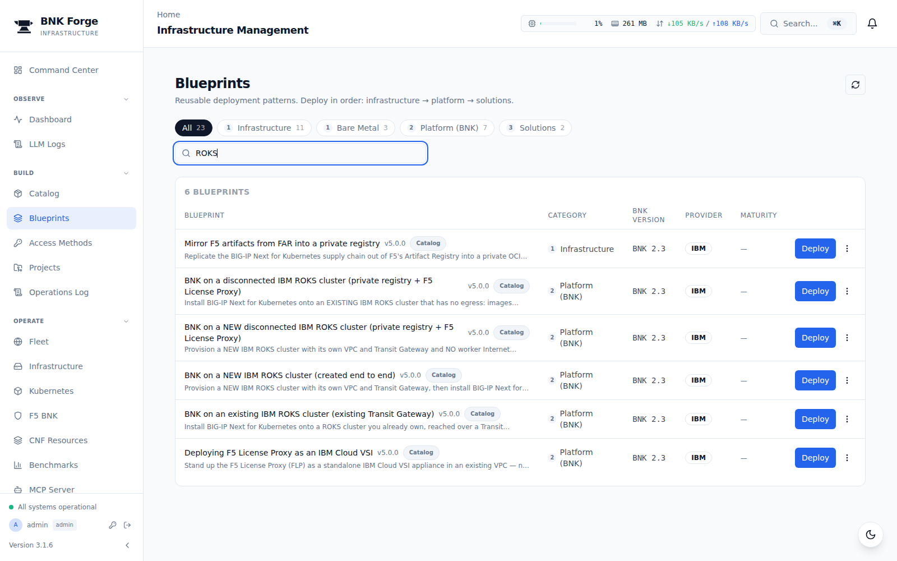

Six blueprints are yours to use:

| Blueprint | Use it for |
|---|---|
| **BNK on a NEW IBM ROKS cluster** | use case 1 |
| **BNK on a NEW disconnected IBM ROKS cluster** | use case 2 |
| **BNK on an existing IBM ROKS cluster** | use case 3 |
| **BNK on a disconnected IBM ROKS cluster** | use case 4 |
| **Private Harbor registry on an IBM Cloud VSI** | supporting — use cases 2 and 4 |
| **Deploying F5 License Proxy as an IBM Cloud VSI** | supporting — use cases 2 and 4 |
| **Mirror F5 artifacts from FAR into a private registry** | supporting — fills the registry |

Clicking **Deploy** on any blueprint opens a summary of what it builds and what
it needs before you commit to anything.

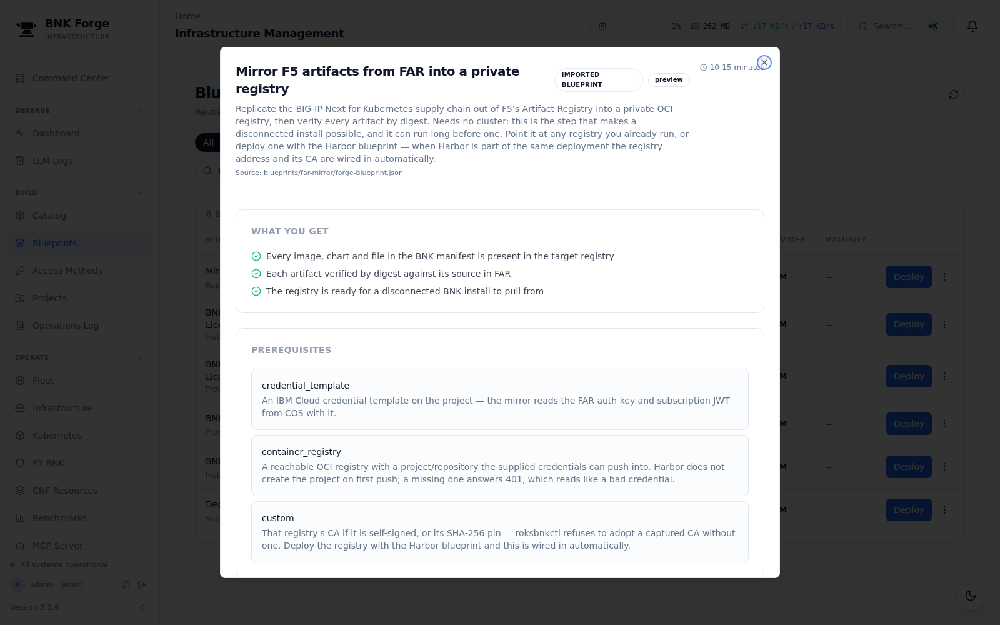

---

## Step 4 — Build the registry and License Proxy (use cases 2 and 4 only)

Skip this step entirely if you are only doing use case 1 or 3.

A disconnected cluster cannot reach F5, so it needs two things inside your
network first: a **private registry** holding a mirrored copy of the BNK supply
chain, and an **F5 License Proxy** to license against. Both are blueprints, and
you build them once — several disconnected clusters can share them.

### 4a — Private Harbor registry (and the mirror)

Deploy **Private Harbor registry on an IBM Cloud VSI**. This one blueprint does
two jobs: it stands up Harbor on a VSI, and then mirrors the whole BNK supply
chain into it. Allow **15–20 minutes**.

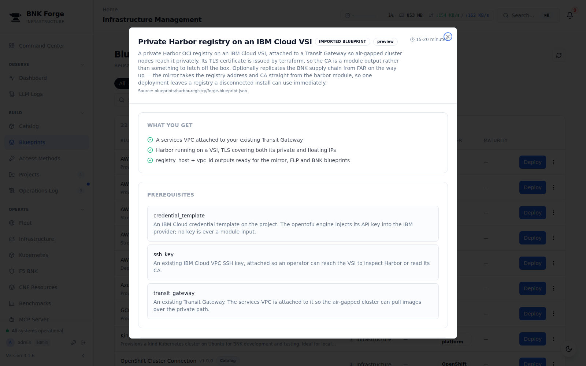

| Field | What to enter |
|---|---|
| **Resource prefix** | e.g. `acme-eu` — names the VSI, VPC and subnet |
| **SSH key name** | an existing IBM Cloud VPC SSH key, for access to the VSI |
| **Harbor admin password** | the password to set for Harbor's `admin` user |
| **Existing Transit Gateway** | the gateway your clusters will attach to |
| **COS bucket** | the bucket holding your FAR auth key and subscription JWT |

Leave the rest blank. Harbor issues its own TLS certificate, and the mirror
picks up the registry address and CA automatically because both modules are in
the same deployment — nothing is copied by hand.

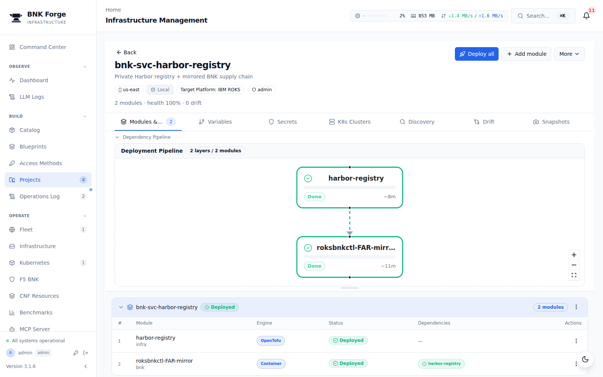

When it finishes, note the registry's **private IP** from the project's outputs.
That is what your clusters will pull from.

### 4b — F5 License Proxy

Deploy **Deploying F5 License Proxy as an IBM Cloud VSI**. Allow **3–5 minutes**.

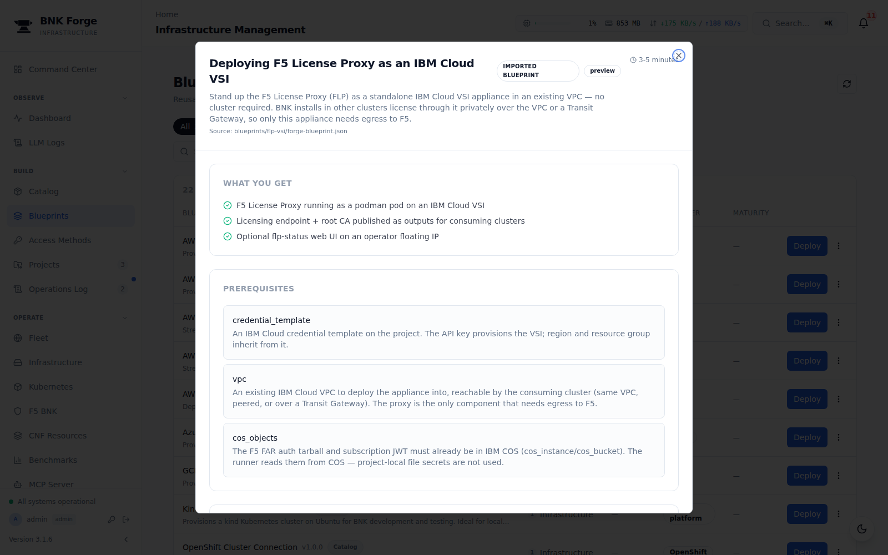

| Field | What to enter |
|---|---|
| **Resource prefix** | the same prefix you used for Harbor |
| **VPC for the proxy** | the services VPC **ID** from the Harbor project's `vpc_id` output — e.g. `r014-6202ec45-…`, not the VPC's name |
| **COS bucket** | the same bucket as above |

Leave the rest blank. Check **Region** matches the VPC — a VPC ID beginning
`r014-` is us-east.

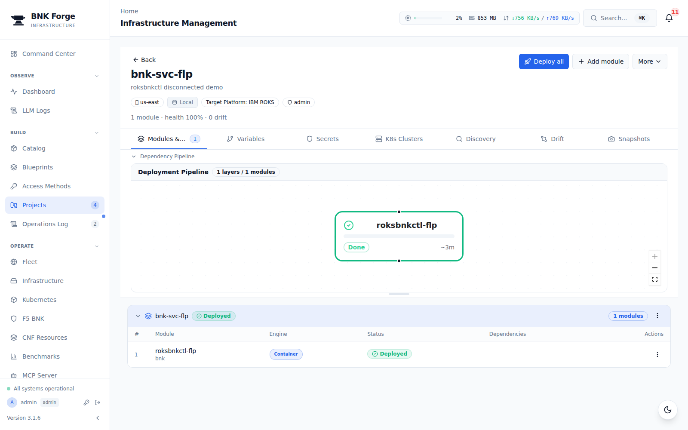

Note the proxy's **private IP** and its **root CA**. You need both when you fill
in a disconnected cluster form.

> **The proxy sits inside the registry's VPC.** That matters when you take these
> down again — destroy the License Proxy **before** the Harbor registry. See
> [Removing a demo](#removing-a-demo).

> **Already have a registry?** Use the **Mirror F5 artifacts from FAR into a
> private registry** blueprint on its own instead of 4a. It needs the registry's
> host and your COS bucket, and it fills any OCI registry you already run.

---

## Step 5 — Fill in the form

Every blueprint asks only for what it genuinely cannot work out for itself.
**Region** and **Resource group** are filled in from the credential template you
pick, and anything left blank falls back to roksbnkctl's own default.

> **Check Region before you deploy.** It comes from the credential template, and
> everything you name on the form — the VPC, the Transit Gateway, the SSH key —
> has to live in that same region. A mismatch surfaces later as a confusing
> "VPC not found" for a VPC that clearly exists.

### Fields common to all four use cases

| Field | What to enter | Notes |
|---|---|---|
| **Resource prefix** | e.g. `acme-eu` | Names every IBM resource created. On the *new cluster* use cases the cluster is named exactly this. |
| **COS bucket** | e.g. `bnk-artifacts-0b5a00334eaf` | The bucket holding your FAR auth key and subscription JWT. **Required** — account-suffixed bucket names cannot be guessed. |

Leave these blank unless your setup differs:

| Field | Default if blank |
|---|---|
| COS instance | `bnk-supply-chain` |
| FAR auth file | `f5-far-auth-key.tgz` |
| Subscription JWT file | `subscription.jwt` |
| BNK manifest version | the version roksbnkctl ships with |
| OpenShift version | `4.20` |
| Workers per zone | `2` (six workers across three zones) |

### Extra fields, use case 1 — new cluster, connected

| Field | What to enter |
|---|---|
| **Cluster VPC address block** | optional, e.g. `10.244.0.0/16` — this cluster gets its own Transit Gateway, so there is nothing to clash with |

### Extra fields, use case 2 — new cluster, disconnected

| Field | What to enter |
|---|---|
| **Existing Transit Gateway** | the gateway your registry and License Proxy are already on |
| **Cluster VPC address block** | **required**, e.g. `10.242.0.0/16` — see the warning below |
| **Registry host** | the mirror's private IP, e.g. `10.243.0.4` |
| **Registry password** | the mirror's admin password |
| **Registry CA (base64)** | the mirror's CA certificate |
| **License Proxy URL** | e.g. `https://10.243.1.4:8443` |
| **License Proxy root CA (base64)** | from the FLP deployment |

> **Why the address block is required here.** A disconnected cluster has to
> share a Transit Gateway with the registry it pulls from. IBM Cloud's default
> gives *every* VPC in a region the same address prefixes, so a second cluster
> on that gateway overlaps the first — and the gateway resolves the ambiguity by
> silently dropping traffic for one of them. It looks like intermittent image
> pull timeouts, with every firewall in the path wide open. Give each cluster
> its own block and it cannot happen.

### Extra fields, use cases 3 and 4 — existing cluster

| Field | What to enter |
|---|---|
| **Existing cluster (name or ID)** | the ROKS cluster to adopt. It is never created or destroyed. |
| **Existing Transit Gateway** | the gateway the cluster's VPC is attached to |

Use case 4 also needs the registry and License Proxy fields listed under use
case 2.

---

## Step 6 — Watch it deploy

Each blueprint runs as a small number of modules in order. Registration always
runs **first**, so the cluster appears on the Kubernetes page and you can watch
BNK arrive on it while the install is still running.

| Use case | Modules |
|---|---|
| 1 and 2 | `cluster-create` → `bnk-install` |
| 3 and 4 | `cluster-registry` → `bnk-install`, with `cwc-guard` alongside |

Roughly how long to allow:

| Step | Time |
|---|---|
| Creating a ROKS cluster | 30–40 minutes |
| Installing BNK | 10–15 minutes |
| Harbor registry + mirroring the supply chain | 15–20 minutes |
| F5 License Proxy | 3–5 minutes |

---

## Step 7 — Confirm BNK is running

Open **Kubernetes** in the left-hand menu and select your cluster. A healthy
install shows around **38 F5 pods running** across the `f5-bnk` and `f5-utils`
namespaces.

To confirm licensing took effect:

```
kubectl -n f5-utils get licenses.k8s.f5net.com
```

| Use case | Expected `MODE` |
|---|---|
| 1 and 3 — connected | `connected` |
| 2 and 4 — disconnected | `f5licenseproxy` |

`STATE` should read `Active` in all four.

---

## Removing a demo

Use **Destroy all** on the project, then delete the project. Blueprints and
modules stay in the catalog for the next run.

On the *existing cluster* use cases this removes BNK and unregisters the cluster
but **leaves your cluster alone** — those blueprints only ever adopted it. On
the *new cluster* use cases it destroys the cluster, its VPC and its Transit
Gateway, because it created them.

### Order matters

Take things down in the reverse of the order you built them:

| | Destroy | Why |
|---|---|---|
| 1 | Your **cluster** projects | They attach to the Transit Gateway the registry uses |
| 2 | The **F5 License Proxy** | Its VSI sits inside the registry's services VPC |
| 3 | The **Harbor registry** | It owns that VPC and deletes it last |

**Destroy the License Proxy before the Harbor registry.** The proxy's VSI lives
in the services VPC that the Harbor blueprint created and owns. They are two
separate projects, so BNK Forge has no way to know they are related and will not
stop you doing it the other way round — but IBM Cloud will. Harbor's destroy
deletes its own VSI, then fails on the subnet and VPC with `vpc_in_use`, because
the proxy is still sitting in them. You are left with a half-removed deployment
to clean up by hand.

The same applies if you only want the projects gone: **destroy first, then
delete**. Deleting a project removes it from BNK Forge but leaves its IBM Cloud
resources running, and once the project is gone there is nothing left to destroy
them with.

If you do hit `vpc_in_use`, nothing is lost. Destroy the License Proxy, then run
**Destroy all** on the Harbor project again — it picks up where it stopped and
removes the subnet and VPC.

---

## If something goes wrong

**Image pulls time out intermittently on a disconnected cluster, but every
firewall allows the traffic.** Two VPCs on the Transit Gateway have overlapping
address prefixes. Give each cluster its own **Cluster VPC address block**.

**A module reports "no IBM Cloud API key".** The project lost its credential
template. Re-select it on the project and re-run the module. BNK Forge 3.1.6
fixes the cause.

**"VPC not found", naming a VPC you can plainly see in the console.** The
deployment ran in a different region from the VPC. **Region** is filled in from
the credential template, so if that template names one region and the VPC,
Transit Gateway or registry you are pointing at lives in another, every lookup
fails this way. Check **Region** on the form matches where those resources
actually are — an IBM VPC ID carries its region in the prefix (`r014-…` is
us-east, `r006-…` us-south), which is the quickest way to tell them apart.

**Destroying the Harbor registry fails part-way, with `vpc_in_use`.** The
License Proxy is still in that VPC. Destroy the proxy, then run **Destroy all**
on the Harbor project again — see [Order matters](#order-matters).

**BNK installs but the licence never activates.** Check the `MODE` above matches
the use case, and that a disconnected cluster can reach the License Proxy
privately.
